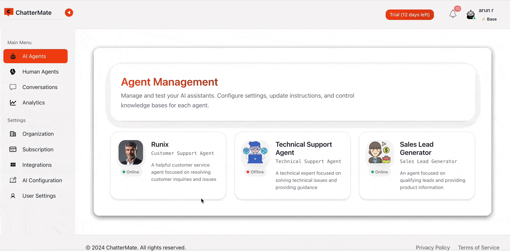
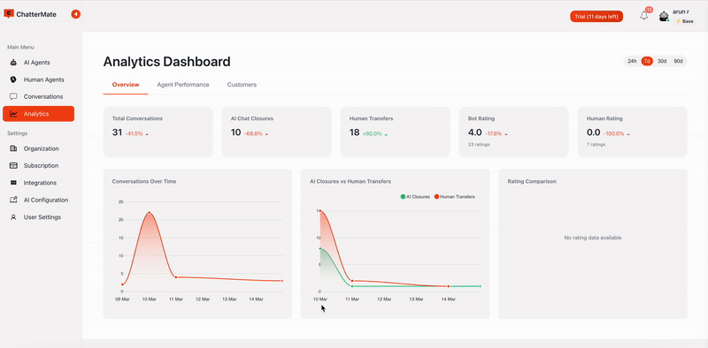

# ChatterMate - AI-Powered ChatBot Agent Framework


ChatterMate is a no-code AI chatbot agent framework. It enables businesses to provide 24/7 support through AI agents that can handle common queries, escalate complex issues to the human agent on need basics, and continuously learn from knowledge base articles. Integrate the chat widget easily on any website. 

## Documentation

[docs.chattermate.chat](https://docs.chattermate.chat)

## Demo
[](https://youtu.be/bk40VSS2BLU)
[](https://www.youtube.com/embed/WyMQ8Poqn5E?mute=1&loop=1&playlist=WyMQ8Poqn5E&rel=0&controls=1)

### Agent Dashboard


### Analytics Dashboard


## Free Signup
https://chattermate.chat

## Features

- 🤖 **AI-Powered Responses**: Context-aware AI with multiple provider support (OpenAI GPT-4, Google AI, Ollama)
- 👥 **Human Handoff**: Seamless transition to human agents when needed
- 🔌 **Deep Integration**: Connect with Jira, Zendesk, Slack, and more (Coming Soon)
- 🎨 **Custom Theming**: Fully customizable chat interface
- 🔐 **Role-Based Access**: Granular control over user permissions
- 📊 **Analytics Dashboard**: Real-time monitoring and insights
- 💾 **Smart Memory**: Maintains conversation context across sessions
- 📚 **Knowledge Base**: Train the AI with your domain knowledge
- 🌐 **Open Source**: Self-hostable and community-driven

### Technical Features

**Backend (Python FastAPI)**


**Frontend (Vue 3)**


## Prerequisites

- Python 3.12+
- PostgreSQL 14+ (with Vector extension)
- Firebase Project for push notification
- Redis (Optional for rate limiting and multiserver socket deployment)

#### Local Development with Docker

For local development, you can build the images yourself:

Make sure to set up your environment variables in a `.env` file in backend and frontend before running Docker.
```bash
# Build and start all services
docker compose up --build

# Run in background
docker compose up -d

# Stop services
docker compose down

# View logs
docker compose logs -f

# View specific service logs
docker compose logs -f db     # PostgreSQL logs
docker compose logs -f redis  # Redis logs
docker compose logs -f backend # Backend logs
docker compose logs -f frontend # frontend logs
```


## Non Docker Installation

### Backend Setup
```bash
cd backend
python -m venv venv
source venv/bin/activate  # Windows: venv\Scripts\activate
pip install -r requirements.txt

# Set up environment variables
cp .env.example .env
# Configure .env with your credentials

# Database setup
alembic upgrade head

# To generate revisions if any model changes 
alembic revision --autogenerate -m "Changes description "
```

### Frontend Setup
```bash
cd frontend

npm install

# Configure environment
cp .env.example .env

```
For Web Push notification, generate a firebase config and keep in folder backend/app/config/firebase-config.json 


## Running the Application


**Backend**
```bash
# Development
uvicorn app.main:app --reload --port 8000

# Run Knowledge Processor (in a separate terminal)
python -m app.workers.run_knowledge_processor

# Production
# Install gunicorn if not already installed
pip install gunicorn

# Run with gunicorn (adjust workers based on CPU cores)
gunicorn app.main:app --workers 4 --worker-class uvicorn.workers.UvicornWorker --bind 0.0.0.0:8000 --access-logfile - --error-logfile - --log-level info

# Run Knowledge Processor as a background service
nohup python -m app.workers.run_knowledge_processor > knowledge_processor.log 2>&1 &
```

**Frontend**
```bash
# Development
npm run dev

# Build Widget for chat to integrate in website
npm run build:widget

# Build Web Client to integrate in website
npm run build:webclient
```

## Testing

**Backend**
```bash
pytest tests/
```

**Frontend**
```bash
# Unit tests
npm run test:unit

# E2E tests
npm run test:e2e
```

## Deployment

For production deployment without Docker:

**Backend**
```bash
# Install production dependencies
pip install gunicorn

# Run with gunicorn
gunicorn app.main:app \
    --workers 4 \
    --worker-class uvicorn.workers.UvicornWorker \
    --bind 0.0.0.0:8000 \
    --access-logfile - \
    --error-logfile - \
    --log-level info \
    --timeout 120

# Run Knowledge Processor
# Option 1: Using systemd (recommended)
sudo tee /etc/systemd/system/chattermate-knowledge-processor.service << EOF
[Unit]
Description=ChatterMate Knowledge Processor
After=network.target

[Service]
User=chattermate
Group=chattermate
WorkingDirectory=/path/to/chattermate/backend
Environment="PATH=/path/to/chattermate/backend/venv/bin"
ExecStart=/path/to/chattermate/backend/venv/bin/python -m app.workers.run_knowledge_processor
Restart=always

[Install]
WantedBy=multi-user.target
EOF

sudo systemctl daemon-reload
sudo systemctl enable chattermate-knowledge-processor
sudo systemctl start chattermate-knowledge-processor

# Option 2: Using supervisor
sudo tee /etc/supervisor/conf.d/chattermate-knowledge-processor.conf << EOF
[program:chattermate-knowledge-processor]
command=/path/to/chattermate/backend/venv/bin/python -m app.workers.run_knowledge_processor
directory=/path/to/chattermate/backend
user=chattermate
autostart=true
autorestart=true
stderr_logfile=/var/log/chattermate/knowledge-processor.err.log
stdout_logfile=/var/log/chattermate/knowledge-processor.out.log
EOF

sudo supervisorctl reread
sudo supervisorctl update
sudo supervisorctl start chattermate-knowledge-processor

# Recommended worker count:
# - CPU bound: 1-2 workers per CPU core
# - I/O bound: 2-4 workers per CPU core
# Example: For a 4-core machine, use 4-16 workers depending on workload
```

**Frontend**
```bash
# Build for production
npm run build

# Serve using nginx or other web server
```

### Docker Deployment

You can run the project using either Docker Compose with local builds or pre-built Docker images.

#### Using Pre-built Images

The following Docker images are available on Docker Hub:
```bash
# Frontend Image
docker pull chattermate/frontend:latest

# Backend Image
docker pull chattermate/backend:latest


```

To run using pre-built images refer docker-compose.prod.yml:

```
docker compose -f docker-compose.prod.yml up -d
```


## Roadmap


- 🔄 Auto Follow-up System for idle customer

- 📘 Customer Contact Management

- 🤝 Human Agent AI Suggestions

- 📞 AI Voice Chat or Call

- 🔌 Third-party Integrations
  - Slack workspace connection


## Contributing

1. Fork the repository
2. Create a feature branch (`git checkout -b feature/amazing-feature`)
3. Commit your changes (`git commit -m 'Add amazing feature'`)
4. Push to the branch (`git push origin feature/amazing-feature`)
5. Open a Pull Request

### Development Guidelines
- Follow PEP 8 style guide
- Write tests for new features
- Update documentation as needed
- Add type hints to new functions

## Support

- 🐛 Issues: [GitHub Issues](https://github.com/chattermate/chattermate/issues)
- 📧 Email: support@chattermate.chat


---

Made with ❤️ by the ChatterMate team 
